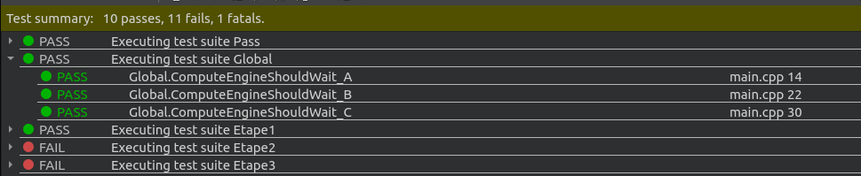

## PCO Labo 6

**Auteurs:** Barros Henriques Chris, Saucy Quentin


### Étape 1

On a donc tout d’abord implémenté *requestComputation* et *getWork* pour permettre aux calculateurs de travailler. On a donc défini:


```c++
ComputationManager::ComputationManager(int maxQueueSize): MAX_TOLERATED_QUEUE_SIZE(maxQueueSize),notFull(NBR_OPTIONS),notEmpty(NBR_OPTIONS)
{
    id = 0;
    resultId=0;
    for(int i =0;i<NBR_OPTIONS;i++){
        queueBuffer.push_back(std::queue<Request>());
    }
}
```

Ce constructeur qui initialise plusieurs éléments:

- `id` et `resultId` : qui permettent respectivement de connaître garder une trace de l’ID qu’aura le prochain calcul à être initialisé et l’ID du prochain résultat à s’être terminé (servira surtout plus tard)
- `notFull` et `notEmpty` : sont des tableaux de *Condition* qui permettent de définir le nombre de types de calculateurs spécialisés et de leur associer une *Condition* chacun. Ces *Conditions* permettent alors l’attente du buffer dans le cas où il serait vide ou plein
- `queueBuffer` : est un tableau de la taille du nombre de types de calculateurs et contenant des queue pour assurer l’ordre d’arrivée pour chaque *Request* la composant 


```c++
int ComputationManager::requestComputation(Computation c) {
    monitorIn();
    size_t valueOfComputationType = (size_t)c.computationType;
    if (!stopped && 
        queueBuffer.at(valueOfComputationType).size() 
        == MAX_TOLERATED_QUEUE_SIZE){
        wait (notFull.at(valueOfComputationType));
  	}
    
    queueBuffer.at(valueOfComputationType).emplace(Request(c,id));
    int oldId =id;
    id++;
    signal(notEmpty.at(valueOfComputationType));
    monitorOut();

    return oldId;
}
```

On utilise le moniteur pour s’assurer une section protégée. Tout d’abord on vérifie si la queue a atteint sa taille maximale tolérée (qui vaut par défaut 10) pour le type de calcul passé. On le fait en utilisant *valueOfComputationType* comme index pour *queueBuffer*. Ayant lu tout le rapport, on sait qu’à la dernière étape, il va falloir permettre de stopper le buffer, donc on teste aussi la variable *stopped* même si pour le moment elle ne sert pas encore. Si le test est vrai, alors on fait attendre le calcul, sinon on l’ajoute à *queueBuffer* et on incrémente la valeur de *id* pour l’arrivée de la prochaine requête de calcul. Finalement, on signale qu’on peut libérer une place pour *getWork* et on sort de la section protégée et on retourne l’*id* de la requête que l’on a empilé.


```c++
Request ComputationManager::getWork(ComputationType computationType) {

    monitorIn();
    size_t valueOfComputationType = (size_t)computationType;
    if (queueBuffer.at(valueOfComputationType).size()==0){      
    	wait(notEmpty.at(valueOfComputationType));
    }
    
    
    Request r = queueBuffer.at(valueOfComputationType).front();
    queueBuffer.at(valueOfComputationType).pop();
    signal(notFull.at(valueOfComputationType));
    monitorOut();

    return r;
}
```

Encore une fois, on entre en section protégée on récupère le type de calcul qui va devoir commencer à être fait. On teste si un calcul du type obtenu précédemment est déjà en train de travailler. Si c’est le cas, on attend, sinon on peut pop ce fameux calcul de la queue et on l’utilise pour créer une requête pour commencer le calcul. On signale alors qu’une place s’est libérée pour *requestComputation*, on sort de la section protégée et on retourne la requête nouvellement créée.


En lançant les tests, on voit que l’on passe effectivement tout:




### Étape 2

On souhaite maintenant pouvoir récupérer les résultats des calculateurs via *getNextResult* et *provideResult*.


On a utilisé un autre élément afin de permettre de lier un calcul qui s’est terminé avec son id: la map *resultMap*.

```c++
void ComputationManager::provideResult(Result result) {
    monitorIn();
    resultMap.insert(std::pair<int,Result>(result.getId(),result));
    signal(notEmptyResult);
    monitorOut();
}
```

*provideResult*insère les différentes résultats issus des calculs terminés. On protège donc cette section avec le moniteur et on signale qu’un élément y a justement été ajouté.


```c++
Result ComputationManager::getNextResult() {
	monitorIn();

    while((resultMap.size()==0)){
        if(stopped) break;
        wait(notEmptyResult);
    }

    Result r = resultMap.begin()->second;
    if(!stopped){
    	resultId++;
    	resultMap.erase(resultMap.begin());
    }
    monitorOut();

    return r;
}
```

Dans cette méthode, on nous a indiqué que son appel est potentiellement bloquant. En effet, on doit attendre qu’il y ait au moins un résultat en attente dans *resultMap* afin de permettre l’affichage de sa terminaison. On teste donc que cette map ne soit pas vide, sinon on attend. 

On a prévu le cas où un appel au bouton d’arrêt aurait été déjà fait et on s’assure alors de ne pas incrémenter *resultId* et d’effacer un élément de la map si c’est le cas. Finalement on retourne ce résultat.


On sait que normalement tous les tests de l’étape 1 passe encore car nous n’avons fait intervenir aucune variable utilisée précédemment. Il n’y a donc pas de risque de perturbation ou d’interblocage.


En lançant les tests, on voit que l’on passe effectivement tout:


### Étape 3


```c++
bool ComputationManager::continueWork(int id) {
    monitorIn();
    if(std::find(aborted.begin(),aborted.end(),id)==aborted.end() && !stopped){
        monitorOut();
        return true;
    }
    monitorOut();
    return false;
}
```

Cette méthode sert simplement à contrôler qu’un calcul dont l’id a été passé en paramètre n’a pas été ajouté à la liste des calculs qui ont été stoppés. Si jamais on trouve le calcul, on renvoie true, sinon false.


```c++
void ComputationManager::abortComputation(int id) {
    monitorIn();
    aborted.emplace_back(id);
    if(resultMap.find(id)!=resultMap.end()){
        resultMap.erase(resultMap.find(id));
    }
    signal(notEmptyResult);
    monitorOut();
}
```

On appelle cette méthode quand on souhaite alors arrêter un calcul qui est en cours. On le place dans la liste. Puis pour s’assurer qu’il n’y est pas 2 fois, on parcourt la liste pour s’en assurer. Si c’est le cas, on supprime la première occurrence. Puis on signale qu’un nouveau résultat peut être affiché.

Pour ces deux méthodes nouvellement implémentées, il n’y aucun appel à *wait* car elles ne doivent pas être bloquantes.


On doit aussi modifier quelque peu le code que l’on avait écrit précédemment pour tenir compte de cet arrêt:

```c++
Request ComputationManager::getWork(ComputationType computationType) {
    monitorIn();

    size_t valueOfComputationType = (size_t)computationType;

    while(true){
        if (queueBuffer.at(valueOfComputationType).size()==0){
            wait(notEmpty.at(valueOfComputationType));
        }

        if ( std::find(aborted.begin(), aborted.end(), 												queueBuffer.at(valueOfComputationType).front().getId() ) 
            != aborted.end()){
             queueBuffer.at(valueOfComputationType).pop();
        }
        else{
             break;
        }
    }
    Request r = queueBuffer.at(valueOfComputationType).front();
    queueBuffer.at(valueOfComputationType).pop();
    signal(notFull.at(valueOfComputationType));
    monitorOut();

    return r;
}
```

Il a fallu ajouter la boucle while qui permet de vérifier que le calcul n’a pas été ajouté dans la liste de ceux qui ont été annulés, sinon il faut le retirer de *queueBuffer*.


```c++
Result ComputationManager::getNextResult() {
    monitorIn();

    while (std::find(aborted.begin(),aborted.end(),resultId)!=aborted.end()) {
        resultId++;
    }

    while((resultMap.size()==0 or resultMap.find(resultId)==resultMap.end())){
        if(stopped) break;
        wait(notEmptyResult);
        while (std::find(aborted.begin(),aborted.end(),resultId)!=aborted.end()) {
            resultId++;
        }
    }

    Result r = resultMap.begin()->second;
    if(!stopped){
    	resultId++;
    	resultMap.erase(resultMap.begin());
    }
    monitorOut();


    if(stopped) throwStopException();
    return r;
}
```

Dans cas-ci, il fallait s’assurer que l’on faisait avancer la variable *resultId* autant de fois qu’il a de calculs qui ont été annulés. Et on s’assure ensuite qu’on fait de même lorsqu’un calcul a fini d’attendre, car il y a pu y avoir des calculs qui ont été annulés entre temps.


Nous avons, depuis la GUI, essayé d’arrêter un calcul A et de voir si l’ordre était correctement préservé.


Comme on le voit, le A s’est correctement arrêté, et B et C se sont bien terminés en même temps car C a fini avant, mais B avait été appelé avant C. Puis une nouvelle tâche A est appelée et on voit qu’elle s’est correctement terminée.


On peut alors se demander si appeler 3 calculs du même type et d’en arrêter empêcherait à un autre de démarrer:


Mais comme on le voit ici, ce n’est pas le cas.


On voit aussi que le nombre en train ayant fait une requête est bel et bien limité. 


Mais qu’il ne reste pas pour autant bloqué:


Dans ces trois captures, on voit bien entendu que les id sont toujours correctement respectés et l’ordre aussi.


Mais pour une raison que l’on ignore, on ne passe pas le test de l’interblocage:


Cela doit venir un signal qui n’est pas appelé lorsqu’on est censé libérer un calculateur. Mais nous n’avons pas réussi à régler ce problème. 


### Étape 4


```c++
void ComputationManager::stop() {
    monitorIn();
    stopped = true;
    for(auto it: queueBuffer){
        for(unsigned i = 0; i < notEmpty.size(); ++i){
            for(unsigned j = 0; j < it.size(); ++j){
                signal(notEmpty.at(i));
            }
        }

        for(unsigned i = 0; i < notFull.size(); ++i){
            for(unsigned j = 0; j < it.size(); ++j){
                signal(notFull.at(i));
            }
        }

        for(unsigned i = 0; i < it.size(); ++i){
            signal(notEmptyResult);
        }
    }
    monitorOut();
}
```

Cette méthode doit uniquement changer la valeur de *stopped* à true afin que certains de if vus précédemment ne passent plus. De plus, on relâche tous les threads qui seraient encore en attente. Pour cela, on parcourt queueBuffer qui contient 3 types de calculateurs et on relâche alors à chaque fois le nombre de threads qui attende pour *notEmpty* et *notFull* et tout pour chaque type de calculateur. On fait alors de même pour les threads qui attendent de pouvoir d’être affichés (*notEmptyResult*).


Pour le reste, il n’y a pas de changements sauf l’ajout de l’appel à la méthode privée *throwStopException* si jamais la variable *stopped* est à true. 


Finalement, nous avons testé que les threads étaient bien stoppés lorsque l’on appuie sur le bouton Stop.


On note toutefois cette fois-ci que l’interblocage intervient bien car les threads ne semblent pas pouvoir se terminer correctement (Il devrait y avoir le message: “Compute engines threads are joinded”).


Encore une fois, on ne passe pas le test de l’étape précédente ni deux autres de cette étape. Mais nous suspectons que l’interblocage empêche le relâchement et la garantie de l’ordre lorsque l’on termine avec stop.


### Conclusion


